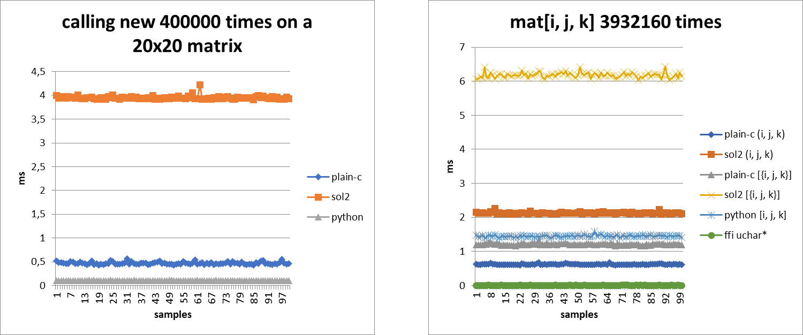

# OpenCV bindings for lua

OpenCV bindings for luajit and lua 5.1/5.2/5.3/5.4.

The aim is to make it as easy to use as [opencv-python](https://pypi.org/project/opencv-python/).

Therefore the [OpenCV documentation](https://docs.opencv.org/4.x/index.html) should be the reference.

## Table Of Contents

<!-- START doctoc generated TOC please keep comment here to allow auto update -->
<!-- DON'T EDIT THIS SECTION, INSTEAD RE-RUN doctoc TO UPDATE -->

- [Installation](#installation)
  - [Prerequisites to source rock install](#prerequisites-to-source-rock-install)
    - [Windows](#windows)
    - [Linux](#linux)
  - [How to install](#how-to-install)
- [Examples](#examples)
  - [Show image](#show-image)
  - [Video capture Camera](#video-capture-camera)
  - [Rotate an image](#rotate-an-image)
  - [Drawing contours](#drawing-contours)
  - [Template matching](#template-matching)
- [Running examples](#running-examples)
  - [Prerequisites to run examples](#prerequisites-to-run-examples)
    - [Windows](#windows-1)
    - [Linux](#linux-1)
  - [Initialize the project](#initialize-the-project)
    - [Windows](#windows-2)
    - [Linux](#linux-2)
- [Hosting you own binary rocks](#hosting-you-own-binary-rocks)
- [Keyword arguments](#keyword-arguments)
- [How to translate python/c++ code](#how-to-translate-pythonc-code)
  - [Python translation example](#python-translation-example)
- [Lua Gotchas](#lua-gotchas)
  - [1-indexed](#1-indexed)
  - [Instance method calls](#instance-method-calls)
  - [Strict compliance with the documentation](#strict-compliance-with-the-documentation)
  - [Memory](#memory)
  - [Matrix manipulation](#matrix-manipulation)
- [Switching from sol2 to plain-c](#switching-from-sol2-to-plain-c)

<!-- END doctoc generated TOC please keep comment here to allow auto update -->

## Installation

Prebuilt binaries are available for [LuaJIT 2.1](https://luajit.org/) and [Lua 5.1/5.2/5.3/5.4](https://www.lua.org/versions.html), and only on Windows and Linux.

### Prerequisites to source rock install

#### Windows

  - Install [LuaRocks](https://github.com/luarocks/luarocks/wiki/Installation-instructions-for-Windows)
  - Install [CMake >= 3.25](https://cmake.org/download/)
  - Install [Git](https://git-scm.com/)
  - Install [NodeJS](https://nodejs.org/en/download/current)
  - Install [Python](https://www.python.org/downloads/)
  - Install [Visual Studio 2022 >= 17.7.2 with .NET Desktop and C++ Desktop](https://visualstudio.microsoft.com/fr/downloads/)
  - In your windows search, search and open the `x64 Native Tools Command Prompt for VS 2022`

#### Linux

  - Install [LuaRocks](https://github.com/luarocks/luarocks/wiki/Installation-instructions-for-Unix)
  - Install [NodeJS](https://nodejs.org/en/download/current)
  - Install needed packages `sudo snap install cmake --classic && sudo apt -y install build-essential git python3-pip python3-venv python-is-python3 ninja-build unzip zip libgtk2.0-dev pkg-config libavcodec-dev libavformat-dev libswscale-dev libtbb2 libtbb-dev libjpeg-dev libpng-dev libtiff-dev libdc1394-dev libreadline-dev`
  - For faster build time, you can use [Ninja](https://ninja-build.org/) `luarocks config --scope project cmake_generator Ninja`

### How to install

I recommend you to try installing the prebuilt binary with

```sh
luarocks install --server=https://github.com/smbape/lua-opencv/releases/download/v0.0.4 opencv_lua
```

Or to specify the target lua version

```sh
luarocks install --server=https://github.com/smbape/lua-opencv/releases/download/v0.0.4 opencv_lua 4.9.0luajit2.1
luarocks install --server=https://github.com/smbape/lua-opencv/releases/download/v0.0.4 opencv_lua 4.9.0lua5.4
luarocks install --server=https://github.com/smbape/lua-opencv/releases/download/v0.0.4 opencv_lua 4.9.0lua5.3
luarocks install --server=https://github.com/smbape/lua-opencv/releases/download/v0.0.4 opencv_lua 4.9.0lua5.2
luarocks install --server=https://github.com/smbape/lua-opencv/releases/download/v0.0.4 opencv_lua 4.9.0lua5.1
```

If none of the above works for you, then install the source rock

```sh
luarocks install --server=https://github.com/smbape/lua-opencv/releases/download/v0.0.4 opencv_lua 4.9.0
```

## Examples

On Windows, the lua_modules modules should be added to PATH as show with `luarocks path`

```sh
set "PATH=%LUA_MODULES%\bin;%APPDATA%\luarocks\bin;%PATH%"
```

`LUA_MODULES` pointing to your lua_modules folder if any.

For example, in your lua project, initialized with `luarocks init`, modify the file `lua.bat` and after the line `set "LUAROCKS_SYSCONFDIR=` add

```cmd
set LUA_MODULES=%~dp0lua_modules
set "PATH=%LUA_MODULES%\bin;%APPDATA%\luarocks\bin;%PATH%"
```

### Show image

```lua
local opencv_lua = require("opencv_lua")
local cv = opencv_lua.cv

local img = cv.imread("lena.jpg")
cv.imshow("Image", img)
cv.waitKey()
cv.destroyAllWindows()
```

### Video capture Camera

```lua
local opencv_lua = require("opencv_lua")
local cv = opencv_lua.cv
local int = opencv_lua.math.int

local camId = 0
local cap = cv.VideoCapture(camId)
if not cap:isOpened() then error("!>Error: cannot open the camera " .. camId) end

local CAP_FPS = 60
local CAP_SPF = int(1000 / CAP_FPS)

cap:set(cv.CAP_PROP_FRAME_WIDTH, 1280)
cap:set(cv.CAP_PROP_FRAME_HEIGHT, 720)
cap:set(cv.CAP_PROP_FPS, CAP_FPS)

while true do
    -- Without this, memory grows indefinitely
    collectgarbage()

    local start = cv.getTickCount()
    local read, frame = cap:read()
    if not read then
        io.stderr:write("!>Error: cannot read the camera.\n")
    end
    local fps = cv.getTickFrequency() / (cv.getTickCount() - start)

    -- Flip the image horizontally to give the mirror impression
    local frame = cv.flip(frame, 1)

    cv.putText(frame, string.format("FPS : %.2f", fps), { 10, 30 }, cv.FONT_HERSHEY_PLAIN, 2, {255, 0, 255}, 3)
    cv.imshow("capture camera", frame)

    local key = cv.waitKey(CAP_SPF)
    if key == 0x1b or key == string.byte("q") or key == string.byte("Q") then break end
end

cv.destroyAllWindows()
```

### Rotate an image

```lua
local opencv_lua = require("opencv_lua")
local cv = opencv_lua.cv

local img = cv.imread("lena.jpg")
local angle = 20
local scale = 1

local size = { img.width, img.height }
local center = { img.width / 2, img.height / 2 }
local M = cv.getRotationMatrix2D(center, -angle, scale)
local rotated = cv.warpAffine(img, M, size)

cv.imshow("Rotation", rotated)
cv.waitKey()
cv.destroyAllWindows()
```

### Drawing contours

```lua
local opencv_lua = require("opencv_lua")
local cv = opencv_lua.cv

local img = cv.imread("pic1.png")
local img_grey = cv.cvtColor(img, cv.COLOR_BGR2GRAY)
local ret, thresh = cv.threshold(img_grey, 100, 255, cv.THRESH_BINARY)
local contours, hierarchy = cv.findContours(thresh, cv.RETR_TREE, cv.CHAIN_APPROX_SIMPLE)

print("Found " .. #contours .. " contours")

cv.drawContours(img, contours, -1, { 0, 0, 255 }, 2)

cv.imshow("Image", img)
cv.waitKey()
cv.destroyAllWindows()
```

### Template matching

```lua
local opencv_lua = require("opencv_lua")
local cv = opencv_lua.cv

--[[
Sources:
    https://docs.opencv.org/4.x/d4/dc6/tutorial_py_template_matching.html
--]]

local img_rgb = cv.imread("mario.png")
assert(not img_rgb:empty(), "file could not be read, check with os.path.exists()")
local img_gray = cv.cvtColor(img_rgb, cv.COLOR_BGR2GRAY)
local template = cv.imread("mario_coin.png", cv.IMREAD_GRAYSCALE)
assert(not template:empty(), "file could not be read, check with os.path.exists()")

local h, w = template.height, template.width

local res = cv.matchTemplate(img_gray, template, cv.TM_CCOEFF_NORMED)
local threshold = 0.8

-- transform into an lua table for faster processing in lua
local rows, cols = res.rows, res.cols
res = res:table()

for j = 1, rows do
    local y = j - 1
    for i = 1, cols do
        local x = i - 1
        if res[j][i] >= threshold then
            cv.rectangle(img_rgb, { x, y }, { x + w, y + h }, { 0, 0, 255 }, 2)
        end
    end
end

cv.imshow("res.png", img_rgb)
cv.waitKey()
cv.destroyAllWindows()
```

## Running examples

### Prerequisites to run examples

#### Windows

  - Install [Git](https://git-scm.com/)
  - Install [NodeJS](https://nodejs.org/en/download/current)
  - Install [Visual Studio 2022 >= 17.7.2 with '.NET desktop development' and 'Desktop development with C++'](https://visualstudio.microsoft.com/fr/downloads/)
  - In your windows search, search and open the `x64 Native Tools Command Prompt for VS 2022`

#### Linux

  - Install [NodeJS](https://nodejs.org/en/download/current)
  - Install needed packages `sudo snap install cmake --classic && sudo apt -y install build-essential git ninja-build libreadline-dev unzip ffmpeg libsm6 libxext6`

### Initialize the project

#### Windows

```cmd
git clone --depth 1 --branch 4.9.0 https://github.com/opencv/opencv.git
git clone --depth 1 --branch v0.0.4 https://github.com/smbape/lua-opencv.git
cd lua-opencv
@REM build.bat --target luajit "-DLua_VERSION=luajit-2.1" --install
@REM available versions are 5.1, 5.2, 5.3, 5.4
build.bat --target lua "-DLua_VERSION=5.4" --install
build.bat --target luarocks
luarocks\luarocks.bat install --server=https://github.com/smbape/lua-opencv/releases/download/v0.0.4 opencv_lua
luarocks\luarocks.bat install --deps-only samples\samples-scm-1.rockspec
npm ci
node scripts\test.js --Release
```

#### Linux

```sh
git clone --depth 1 --branch 4.9.0 https://github.com/opencv/opencv.git
git clone --depth 1 --branch v0.0.4 https://github.com/smbape/lua-opencv.git
cd lua-opencv
# ./build.sh --target luajit "-DLua_VERSION=luajit-2.1" --install
# available versions are 5.1, 5.2, 5.3, 5.4
./build.sh --target lua "-DLua_VERSION=5.4" --install
./build.sh --target luarocks
./luarocks/luarocks install --server=https://github.com/smbape/lua-opencv/releases/download/v0.0.4 opencv_lua
./luarocks/luarocks install --deps-only samples/samples-scm-1.rockspec
npm ci
node scripts/test.js --Release
```

## Hosting you own binary rocks

Windows: (Hosting you own binary rocks on Windows)[docs/hosting-you-own-binary-rocks-Windows.md]

Linux: (Hosting you own binary rocks on Linux)[docs/hosting-you-own-binary-rocks-Linux.md]

```sh
luarocks install --server=http://example.com/binary-rock opencv_lua
```

## Keyword arguments

Similar to python [keyword arguments](https://docs.python.org/3/glossary.html#term-argument) or c# [Named parameters](https://learn.microsoft.com/en-us/dotnet/csharp/programming-guide/classes-and-structs/named-and-optional-arguments#named-arguments), keyword arguments free you from matching the order of arguments to the order of parameters in the parameter lists of called methods.

When a function has multiple default parameters, keyword arguments allow you to override only the needed parameters without specifying the previous default parameters.

As an example, given the documentation of [cv.normalize](https://docs.opencv.org/4.x/d2/de8/group__core__array.html#ga87eef7ee3970f86906d69a92cbf064bd)

```cpp
void cv::normalize  (   InputArray       src,
                        InputOutputArray dst,
                        double           alpha = 1,
                        double           beta = 0,
                        int              norm_type = NORM_L2,
                        int              dtype = -1,
                        InputArray       mask = noArray()
    )       
Python:
    cv.normalize( src, dst[, alpha[, beta[, norm_type[, dtype[, mask]]]]] ) -> dst
```

the following expressions are equivalent:

```lua
cv.normalize(src, dst, alpha, beta, norm_type, dtype, mask)
cv.normalize(src, dst, alpha, beta, norm_type, dtype, opencv_lua.kwargs({ mask = mask }))
cv.normalize(src, dst, alpha, beta, norm_type, opencv_lua.kwargs({ dtype = dtype, mask = mask }))
cv.normalize(src, dst, alpha, beta, opencv_lua.kwargs({ norm_type = norm_type, dtype = dtype, mask = mask }))
cv.normalize(src, dst, alpha, opencv_lua.kwargs({ beta = beta, norm_type = norm_type, dtype = dtype, mask = mask }))
cv.normalize(src, dst, opencv_lua.kwargs({ alpha = alpha, beta = beta, norm_type = norm_type, dtype = dtype, mask = mask }))
cv.normalize(src, opencv_lua.kwargs({ dst = dst, alpha = alpha, beta = beta, norm_type = norm_type, dtype = dtype, mask = mask }))
cv.normalize(opencv_lua.kwargs({ src = src, dst = dst, alpha = alpha, beta = beta, norm_type = norm_type, dtype = dtype, mask = mask }))
```

Of course, optional parameters are not mandatory. In other words, if you only want to change the `norm_type` parameter, you can do

```lua
cv.normalize(src, dst, opencv_lua.kwargs({ norm_type = cv.NORM_L1 }))
```

## How to translate python/c++ code

The transformation will usually be straight from python.

`tuples` and `arrays` become `tables`.

`numpy` calls and `arrays` manipulations have their `cv.Mat` counter parts.

`keyword arguments` will be wrapped within `opencv_lua.kwargs`.

### Python translation example

```python
import cv2 as cv

img = cv.imread(cv.samples.findFile("pic1.png"))
img_grey = cv.cvtColor(img, cv.COLOR_BGR2GRAY)
ret, thresh = cv.threshold(img_grey, 100, 255, cv.THRESH_BINARY)
contours, hierarchy = cv.findContours(thresh, cv.RETR_TREE, cv.CHAIN_APPROX_SIMPLE)

print(f"Found { len(contours) } contours")

cv.drawContours(img, contours, -1, ( 0, 0, 255 ) , 2)

cv.imshow("Image", img)
cv.waitKey()
cv.destroyAllWindows()
```

```lua
local opencv_lua = require("opencv_lua")
local cv = opencv_lua.cv

local img = cv.imread(cv.samples.findFile("pic1.png"))
local img_grey = cv.cvtColor(img, cv.COLOR_BGR2GRAY)
local ret, thresh = cv.threshold(img_grey, 100, 255, cv.THRESH_BINARY)
local contours, hierarchy = cv.findContours(thresh, cv.RETR_TREE, cv.CHAIN_APPROX_SIMPLE)

print("Found " .. #contours .. " contours")

cv.drawContours(img, contours, -1, { 0, 0, 255 }, 2)

cv.imshow("Image", img)
cv.waitKey()
cv.destroyAllWindows()
```

## Lua Gotchas

### 1-indexed

Arrays are 1-indexed in `lua`, and 0-indexed in python. Therefore, if you see in python `p[0]`, you should write in lua `p[1]`

More over, opencv functions still expect 0-indexed parameters. For exemple

```lua
for i = 1, #contours do
    -- Notice the i - 1
    cv.drawContours(src, contours, i - 1, {0, 0, 255}, 2)
end
```

### Instance method calls

Instance methods are called with `:` not `.`.

If you see in python

```python
cap = cv.VideoCapture(camId)
read, frame = cap.read()
```

You should write in lua

```python
cap = cv.VideoCapture(camId)
read, frame = cap:read()
```

### Strict compliance with the documentation

For backwards compatibility, python still allows an old syntax for enums and call constructors. This library does not.

If you see in python

```python
cv.ml.SVM_create(...)
cv.ml.SVM_C_SVC
cv.TERM_CRITERIA_MAX_ITER
```

You should write in lua

```lua
cv.ml.SVM.create(...)
cv.ml.SVM.C_SVC
cv.TermCriteria.MAX_ITER
```

### Memory

Image processing can use up a lot of memory. Relying solely on the behaviour of the garbage collector can cause your program to consume more memory than necessary.

Therefore, think about calling `collectgarbage` in those cases.

```lua
local cap = cv.VideoCapture(0)
while true do
    -- Without this, memory grows indefinitely
    collectgarbage()

    local read, frame = cap:read()
    cv.imshow("capture camera", frame)
    if cv.waitKey(0) == 0x1b then break end
end
```

### Matrix manipulation

For maximum speed performance, when you need to manipulate matrices in lua, convert them to `table`s, do your manipulation and convert them back to matrices

```lua
-- transform into an lua table for faster processing in lua
local rows, cols, type_ = res.rows, res.cols, res:type()
res = res:table()

for j = 1, rows do
    local y = j - 1
    for i = 1, cols do
        local x = i - 1
        if res[j][i] >= threshold then
            cv.rectangle(img_rgb, { x, y }, { x + w, y + h }, { 0, 0, 255 }, 2)
        end
    end
end

res = cv.Mat.createFromArray(res, type_)
```

If you are using [LuaJIT](https://luajit.org/), there is even a way to get close to the c performance with the usage of the [FFI Library](https://luajit.org/ext_ffi.html);

```lua
local ffi = require("ffi")

local rows = 512
local cols = 512
local channels = 3
local mat = cv.Mat({ rows, cols, channels }, cv.CV_8U, 255.0)
local bytes = ffi.cast("unsigned char*", mat.data)

local sum = 0
for i = 0, rows - 1 do
    for j = 0, cols - 1 do
        for k = 0, channels - 1 do
            sum = sum + bytes[i * cols * channels + j * channels + k]
        end
    end
end
```

## Switching from sol2 to plain-c

My aim was to create a binding that was at least as fast as the python alternative.

The first implementation using [sol2] was functional but slower than python in some cases.

Those cases included class instance recognition, functions with multiple overloads (cv::Mat has 20 overloads), returning maps and vectors as userdata.

A small test with plain c/c++ bindings of those cases was much faster (5x).

The key performance points were as follows:
  - comparing the hash of the instance's metatable to determine whether it is an instance of a specific class. Inspired by [luaarray](https://www.nongnu.org/techne/lua/luaarray/)
  - checking argument type directly in stack without the sol::variadic_args intermediary
  - returning map/vector as plain tables, which are handled more quickly in lua

In addition, some side effects were a smaller binary (30% less) and a faster compilation time (an average gain of 5mn for 30mn).

I may have used [sol2] in an inefficient way. Nevertheless, I now have a more efficient implementation using plain c/c++.

It is possible to outperform python, however, I haven't found a way that comes close to python's sweet syntaxic sugars.



[sol2]: https://github.com/ThePhD/sol2
